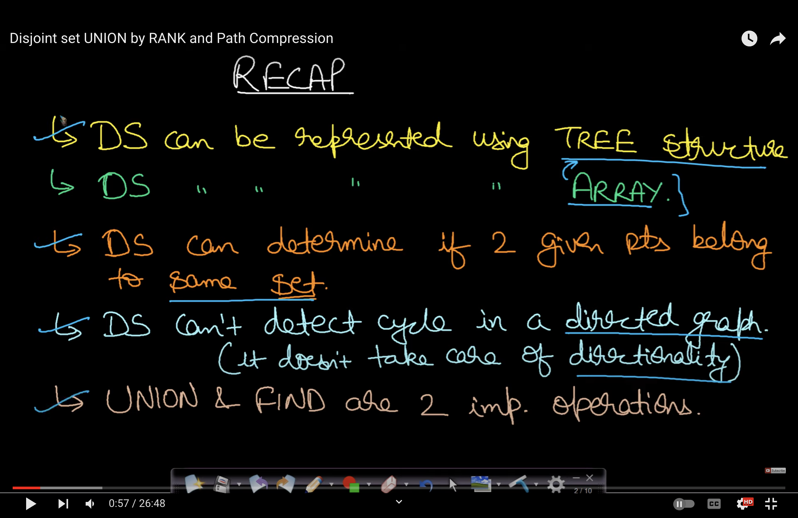

# Links
- [What is union find](https://www.youtube.com/watch?v=ayW5B2W9hfo)
- [Practical](https://www.geeksforgeeks.org/introduction-to-disjoint-set-data-structure-or-union-find-algorithm/)
- [Explanation & Practical](https://www.youtube.com/watch?v=eTaWFhPXPz4)
- [Question Example](https://practice.geeksforgeeks.org/problems/detect-cycle-using-dsu/1)

